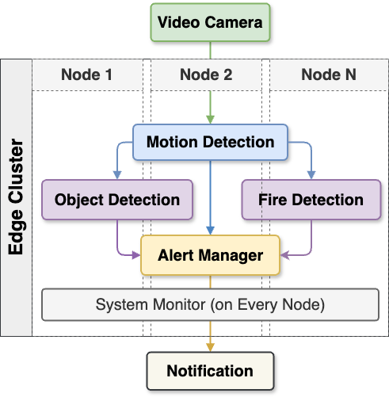
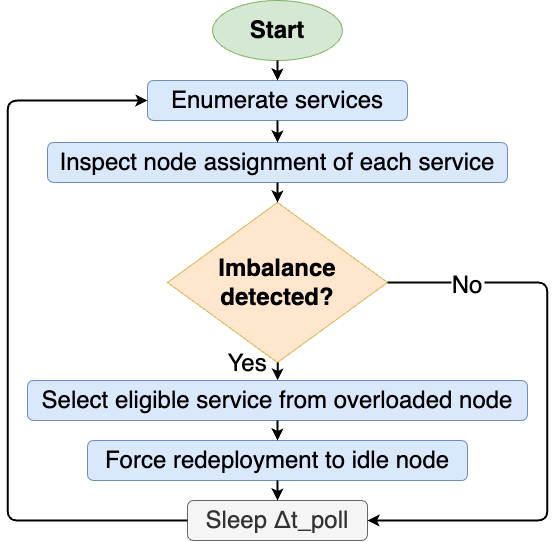
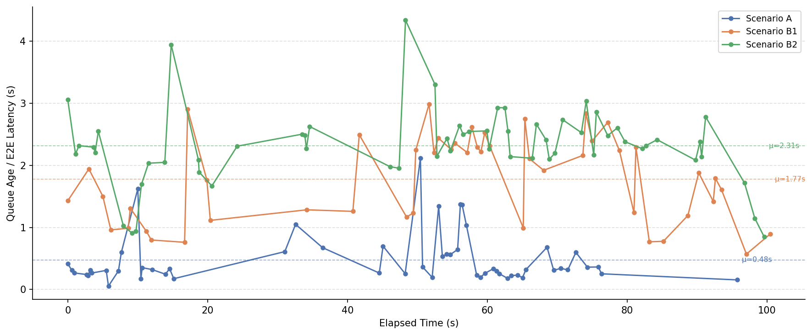
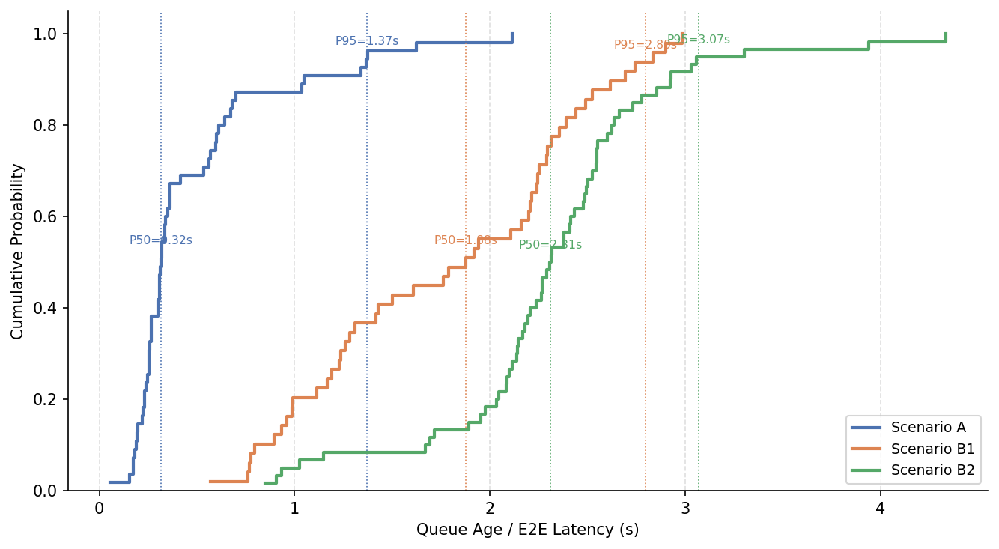
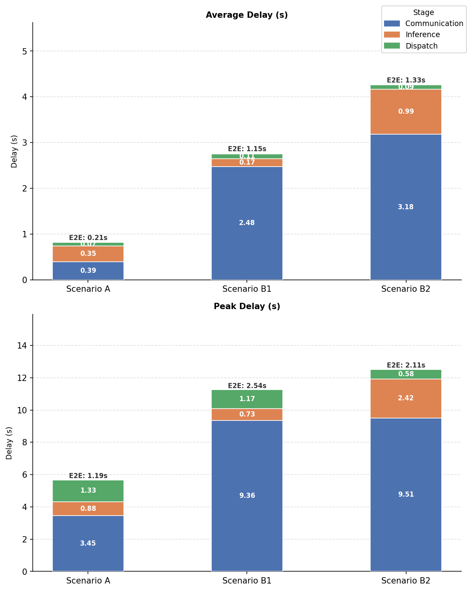
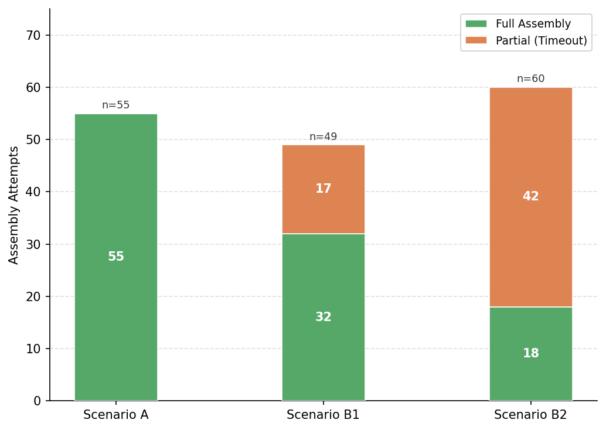
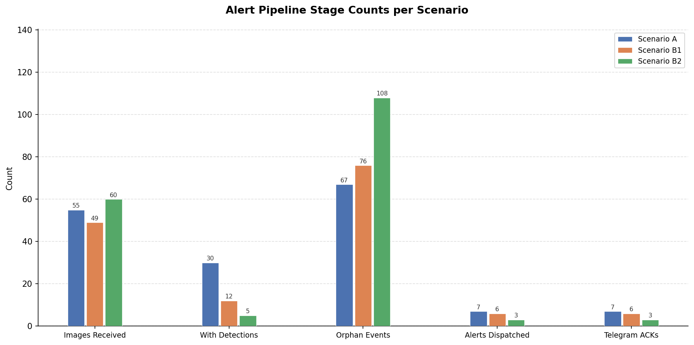
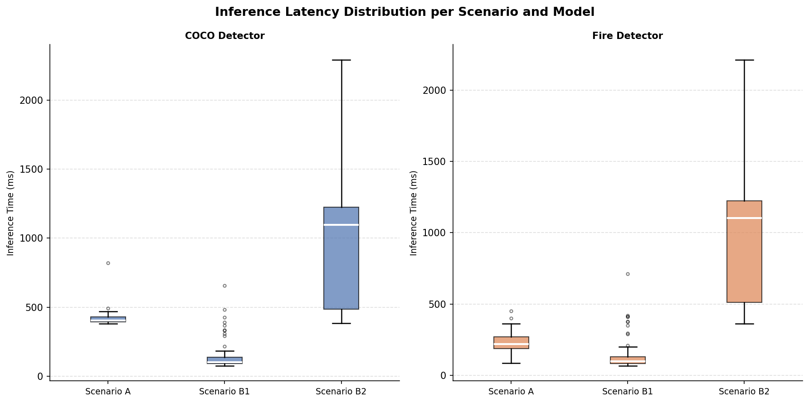
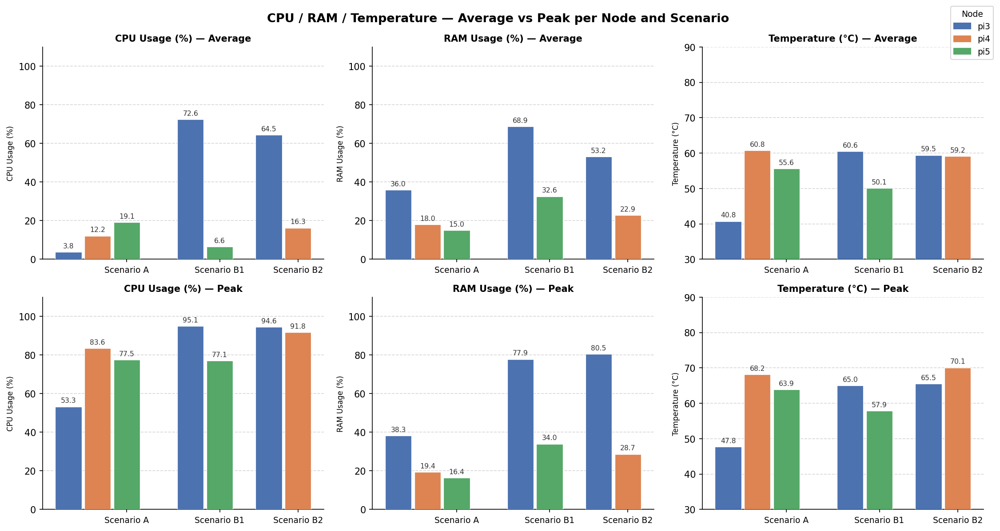
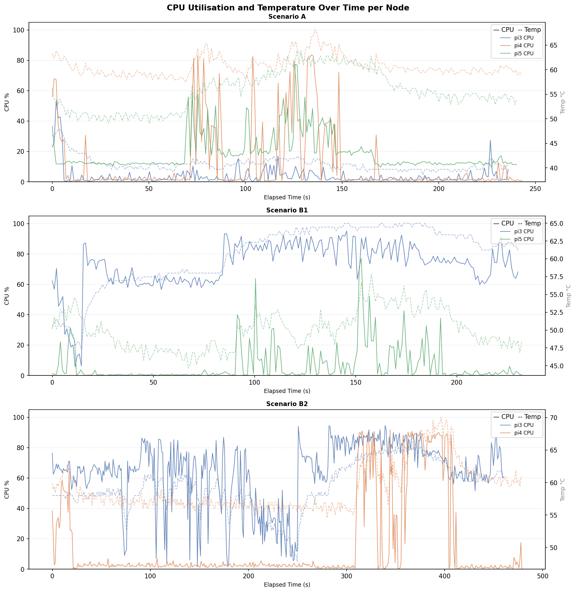

# Distributed Surveillance System

An AI-powered distributed video surveillance system running on a 3-node Raspberry Pi Docker Swarm cluster. It streams live video from a SIYI A8 Mini IP camera, detects motion and objects (including fire and smoke) using NCNN-optimised YOLO models, and dispatches real-time Telegram alerts. The `motion`, `detection_coco`, `detection_fire` and `alert` services communicate over **ROS 2 Humble topics** (DDS); `system_monitor` still uses ZeroMQ pub/sub.

## Architecture



Messages are correlated end-to-end via a per-frame `image_id`. The alert service waits up to 2 s for detection results after a motion image arrives, then dispatches — or fires immediately for `fire` / `weapon` class detections.

### Messaging (ROS 2 topics)

The motion → detection → alert pipeline runs on ROS 2 Humble using the default DDS transport (RMW set to **CycloneDDS**, which is lighter on the Pi edge nodes). Discovery is automatic via DDS multicast, so these services run on the Docker **host network** and must share one LAN subnet and the same `ROS_DOMAIN_ID` (default `0`). No manual peer discovery or fallback hostnames are needed.

Topics are **namespaced per device** by the (ROS-sanitised) hostname, so multiple devices don't collide — e.g. on host `ubuntu-RTX2080` the topics live under `/ubuntu_RTX2080/...` (hyphens become underscores; override with the `ROS_NS` env var). All four services on a device share that namespace.

| Topic (relative) | Type | Publisher → Subscriber |
|-------|------|------------------------|
| `motion/flag` | `std_msgs/String` (JSON) | motion → alert |
| `motion/image` | `sensor_msgs/CompressedImage` (JPEG; metadata in `header.frame_id`) | motion → detection_coco, detection_fire, alert |
| `detection/coco` | `std_msgs/String` (JSON) | detection_coco → alert |
| `detection/fire` | `std_msgs/String` (JSON) | detection_fire → alert |

> **Multi-node note:** because the namespace is per-device, the four services must run on the **same host** to share a namespace. The default `replicas: 1` placement can land them on different Swarm nodes (different namespaces → no communication). For a real multi-Pi deployment, run a full motion+detection+alert set per device (e.g. `mode: global` or per-node pinning), or set a shared `ROS_NS`.

`system_monitor` and `report` are unchanged and still use ZeroMQ pub/sub with UDP-broadcast peer discovery on `255.255.255.255`.

## Services

| Service | Image | Placement | Role |
|---------|-------|-----------|------|
| `motion` | `ds-motion` | NOT pi3 | RTSP capture, frame differencing, publishes motion flag + JPEG frames |
| `detection_coco` | `ds-detection-coco` | NOT pi3 | YOLOv8n NCNN inference on 80 COCO classes |
| `detection_fire` | `ds-detection-fire` | NOT pi3 | YOLO-fire NCNN inference for fire and smoke |
| `alert` | `ds-alert` | any node | Event correlation, anti-spam cooldown, Telegram/webhook dispatch |
| `system_monitor` | `ds-system-monitor` | **global** (all nodes) | 1 Hz CPU, RAM, temperature, disk and network telemetry |
| `rebalancer` | `docker:27-cli` | manager + NOT pi3 | Polls every 15 s, moves services off overloaded nodes via `docker service update --force` |
| `zswarm-dashboard` | `mohsenasm/swarm-dashboard` | **global** (managers) | Docker Swarm web dashboard on port 8080 |

### motion
Reads the RTSP stream via FFmpeg at 10 FPS, applies Gaussian blur and frame differencing to detect motion. Publishes a `motion_flag` (JSON) on `motion/flag` and JPEG frames as `sensor_msgs/CompressedImage` on `motion/image`, carrying a unique `image_id` in the message `header.frame_id`. A configurable cooldown (default 1 s) prevents flooding the detection pipeline.

### detection\_coco
Subscribes to `motion/image`. Runs YOLOv8n NCNN inference (confidence ≥ 0.5) and publishes `detection_results` on `detection/coco`, preserving the source `image_id` for correlation.

### detection\_fire
Identical architecture to `detection_coco` but uses a fire-specific YOLO model. Publishes on `detection/fire`.

### alert
Correlates `motion_flag`, `motion_image`, and `detection_results` messages by `image_id` and sender node. Implements:
- **2 s detection wait** before processing a motion-only event
- **60 s anti-spam cooldown** per detected class
- **Immediate dispatch** for `fire` and `weapon` class detections (configurable via `ALERT_IMMEDIATE_CLASSES`)
- **Telegram** photo messages with optional image attachment
- **Webhook** POST (optional)

### system\_monitor
Runs on every Swarm node. Collects CPU %, memory (used/total GB, %), disk I/O (KB/s), network I/O (KB/s) and CPU temperature. Logs to `logs/{hostname}-htop-HH.MM.SS.log`. Publishes structured JSON metrics on port 5560.

### rebalancer
Runs as a shell script inside a `docker:27-cli` container with the Docker socket mounted. Every 15 s it checks whether any node has zero replicated services while another has more than one, and moves one service at a time (with a 60 s per-service cooldown) to restore balance. Excludes global-mode services and itself.



## Setup & Deployment

### Prerequisites

- Docker Swarm initialised with at least one manager node
- All nodes joined to the swarm (`docker swarm join ...`)
- Docker Hub account (or private registry) for image distribution
- Python 3.10+ if running services outside Docker

### 1. Configure Telegram alerts

```bash
cp .env.example .env
```

Edit `.env`:

```env
ALERT_TELEGRAM_ENABLED=true
ALERT_TELEGRAM_BOT_TOKEN=YOUR_BOT_TOKEN
ALERT_TELEGRAM_CHAT_ID=YOUR_CHAT_ID
ALERT_TELEGRAM_ATTACH_IMAGE=true
```

`deploy_stack.sh` sources `.env` automatically before deploying the stack.

### 2. Set your Docker Hub username

Either edit `deploy_stack.sh` directly:

```bash
DOCKERHUB_USERNAME="your_username"
```

Or export it in your shell:

```bash
export DOCKERHUB_USERNAME="your_username"
```

### 3. Build, push, and deploy

```bash
./deploy_stack.sh
```

This script will:
1. Remove any existing `ds_2026` stack
2. Build and push Docker images to Docker Hub
3. Deploy the stack with `docker stack deploy`

### Hostname-aware logging

Every container mounts `/etc/hostname` as `/host_hostname` (read-only). The shared logger uses this value so log files are automatically grouped per physical device (e.g. `logs/pi4.log`) without any hardcoded environment variables.

## Configuration

All defaults live in `shared/config.py` and can be overridden at runtime via environment variables.

### Ports

The ROS 2 services (`motion`, `detection_*`, `alert`) no longer use fixed TCP ports — DDS negotiates ports dynamically over the host network. The remaining fixed ports:

| Port | Protocol | Service | Purpose |
|------|----------|---------|---------|
| 5560 | TCP (ZMQ PUB) | system\_monitor | System telemetry |
| 50001 | UDP | system\_monitor | Peer discovery broadcast |
| 8080 | HTTP | zswarm-dashboard | Swarm web UI |

ROS 2 / DDS uses UDP in the ephemeral range (multicast `239.255.0.1` for discovery plus per-participant unicast ports) on the host network; ensure the LAN/firewall allows it between nodes.

### Key environment variables

| Variable | Default | Service | Description |
|----------|---------|---------|-------------|
| `ROS_DOMAIN_ID` | `0` | motion / detection / alert | ROS 2 DDS domain; must match across all ROS 2 nodes |
| `RMW_IMPLEMENTATION` | `rmw_cyclonedds_cpp` | motion / detection / alert | DDS middleware (CycloneDDS for edge) |
| `TOPIC_MOTION_IMAGE` | `motion/image` | motion / detection / alert | Override the motion image topic name |
| `MOTION_URL` | `rtsp://192.168.144.25:8554/main.264` | motion | RTSP source URL |
| `MOTION_FPS` | `10` | motion | Capture / process frame rate |
| `MOTION_THRESHOLD` | `0.5` | motion | Pixel-change ratio to trigger motion |
| `MOTION_IMAGE_PUBLISH_COOLDOWN` | `1.0` | motion | Min seconds between published frames |
| `YOLO_COCO_CONFIDENCE` | `0.5` | detection\_coco | Minimum COCO detection confidence |
| `YOLO_FIRE_CONFIDENCE` | `0.5` | detection\_fire | Minimum fire detection confidence |
| `ALERT_DETECTION_WAIT_SECONDS` | `2.0` | alert | How long to wait for detection results after a motion image |
| `ALERT_COOLDOWN_SECONDS` | `60` | alert | Anti-spam cooldown per class |
| `ALERT_IMMEDIATE_CLASSES` | `["weapon","fire"]` | alert | Classes that bypass the cooldown |
| `ALERT_TELEGRAM_ENABLED` | `false` | alert | Enable Telegram notifications |
| `ALERT_TELEGRAM_BOT_TOKEN` | — | alert | Telegram bot token (from `.env`) |
| `ALERT_TELEGRAM_CHAT_ID` | — | alert | Telegram chat/channel ID (from `.env`) |
| `ALERT_TELEGRAM_ATTACH_IMAGE` | `true` | alert | Attach the triggering JPEG to the Telegram message |
| `ALERT_WEBHOOK_ENABLED` | `false` | alert | Enable webhook POST |
| `ALERT_WEBHOOK_URL` | — | alert | Webhook endpoint |
| `SYSTEM_MONITOR_INTERVAL` | `1` | system\_monitor | Telemetry collection interval (seconds) |
| `STACK_NAME` | `ds_2026` | rebalancer | Docker stack name to rebalance |
| `POLL_SECONDS` | `15` | rebalancer | Rebalance check interval |
| `COOLDOWN_SECONDS` | `60` | rebalancer | Per-service cooldown after a rebalance move |

## Logging & Monitoring

- **Service logs**: `logs/{hostname}.log` — one file per physical node, shared via the `./logs` bind-mount
- **System monitor logs**: `logs/{hostname}-htop-HH.MM.SS.log`
- **Swarm dashboard**: `http://<manager-node-ip>:8080` — live view of all services, replicas, and node health

---

## Experimental Results

Experiments were run on 2026-03-02 across three node configurations to characterise the impact of node availability on latency, detection quality, and resource utilisation.

### Scenarios

| Scenario | Nodes active | pi3 role | pi4 role | pi5 role |
|----------|-------------|----------|----------|----------|
| **A** (baseline) | pi3 + pi4 + pi5 | Alert only | COCO + fire detection | Motion capture |
| **B1** (pi4 failure) | pi3 + pi5 | Alert + COCO + fire detection | — | Motion capture |
| **B2** (pi5 failure) | pi3 + pi4 | Alert + motion + COCO + fire detection | COCO detection | — |

In Scenarios B1 and B2, the rebalancer redistributes detection services onto remaining nodes. However, pi3 (the alert aggregator) must absorb additional workloads, revealing the cost of co-location.

---

### End-to-End Pipeline Latency

Queue Age measures the full pipeline: camera publish → motion → ROS 2 (DDS) transport → detection → alert dispatch.

| Metric | Scenario A | Scenario B1 | Scenario B2 |
|--------|-----------|------------|------------|
| Queue Age — mean | **0.48 s** | 1.78 s | 2.31 s |
| Queue Age — p50 | **0.32 s** | 1.08 s | 2.01 s |
| Queue Age — p95 | **1.37 s** | 2.84 s | 3.07 s |
| Queue Age — max | 2.12 s | 2.99 s | 4.34 s |
| Alert recv → dispatch (mean) | **0.21 s** | 1.15 s | 1.33 s |
| Alert recv → dispatch (p95) | 0.87 s | 2.41 s | 2.11 s |

Scenario A is **4.8× faster** than B2 (mean Queue Age) and **6.4× faster** on the alert-coordinator's own recv-to-dispatch path.

**E2E latency over time:**



**Latency CDF:**



---

### Pipeline Stage Breakdown

Each image passes through three measurable stages: (1) communication/transmission from source to alert node, (2) YOLO inference, (3) alert dispatch.

| Stage | Scenario A avg | Scenario B1 avg | Scenario B2 avg |
|-------|---------------|----------------|----------------|
| Communication | 0.39 s | 2.48 s | 3.18 s |
| Inference | 0.35 s | 0.17 s | 0.99 s |
| Dispatch | 0.07 s | 0.00 s | 0.05 s |
| **E2E total** | **0.21 s** | **1.15 s** | **1.33 s** |



---

### Event Assembly & Alert Pipeline

| Metric | Scenario A | Scenario B1 | Scenario B2 |
|--------|-----------|------------|------------|
| Images received | 55 | 49 | 60 |
| Full assemblies (image + detections) | **55 / 55 (100%)** | 32 / 49 (65%) | 18 / 60 (30%) |
| Partial assemblies (timeout) | 0 | 17 | 42 |
| Images with ≥1 detection | **30 (54.5%)** | 12 (24.5%) | 5 (8.3%) |
| Orphan / lost events | 67 | 76 | **108** |
| Alerts dispatched | 7 | 6 | 3 |
| Telegram confirmations | 7 / 7 | 6 / 6 | 3 / 3 |

Telegram delivery was **100% reliable** in all scenarios. The detection rate collapse in B1/B2 is caused by inference backpressure: when pi3 is saturated, images expire from the correlation queue before detection completes.

**Assembly breakdown (full vs partial):**



**Alert pipeline stage counts:**



---

### Inference Latency per Model

| Scenario | Node | Model | Infer mean (ms) | Infer p95 (ms) | Infer max (ms) |
|----------|------|-------|----------------|---------------|---------------|
| A | pi4 | COCO | 418 | 455 | 820 |
| A | pi5 | Fire | 228 | 360 | 452 |
| B1 | pi5 | COCO | 155 | 426 | 656 |
| B1 | pi5 | Fire | 150 | 412 | 711 |
| B2 | pi4 | COCO | **955** | 1344 | 2291 |
| B2 | pi4 | Fire | **945** | 1296 | 2213 |

Co-locating both models on pi4 (B2) degrades COCO inference by **+128%** and fire inference by **+314%** relative to the dedicated-node baseline (A).



---

### Resource Utilisation

| Node / Scenario | Avg CPU | Peak CPU | Avg RAM | Avg Temp | Peak Temp |
|----------------|---------|----------|---------|----------|-----------|
| pi3 — A (alert only) | **3.8%** | 53.3% | 35.9% | 40.8°C | 47.8°C |
| pi4 — A (detection) | 12.2% | 83.6% | 18.0% | 60.8°C | 68.2°C |
| pi5 — A (motion) | 19.1% | 77.5% | 15.0% | 55.6°C | 63.9°C |
| pi3 — B1 (alert + detect) | **72.6%** | 95.1% | 68.9% | 60.6°C | 65.0°C |
| pi5 — B1 (idle/motion) | 6.6% | 77.1% | 32.6% | 50.1°C | 57.9°C |
| pi3 — B2 (alert + motion + detect) | **64.5%** | 94.6% | 53.2% | 59.5°C | 65.5°C |
| pi4 — B2 (detection) | 16.3% | 91.8% | 22.9% | 59.2°C | **70.1°C** |

In Scenario A, pi3 averages **under 4% CPU** — alert aggregation alone is lightweight. In B1, pi3 saturates at 72.6% average / 95.1% peak, with RAM reaching 68.9% (≈210 MB headroom before OOM risk). In B2, pi4 reaches 70.1°C peak — at the Raspberry Pi OS thermal throttle boundary.



**CPU utilisation and temperature over time:**



---

### Key Findings

| # | Finding |
|---|---------|
| 1 | Scenario A E2E (Queue Age) is **4.8× lower** than B2; alert recv→dispatch is **6.4× lower** |
| 2 | pi3 CPU saturates at 72–95% when co-located with detection models |
| 3 | Detection rate collapses from **54.5% → 8.3%** as nodes are removed |
| 4 | Orphan/lost events increase **61%** (67 → 108) correlating with pi3 overload |
| 5 | pi3 memory in B1 peaks at 77.9% — OOM risk under sustained load |
| 6 | pi4 reaches 70.1°C in B2 at thermal throttle threshold |
| 7 | Network bandwidth is negligible — the system is entirely compute-bound |
| 8 | Telegram alert delivery is **100% reliable** across all scenarios |
